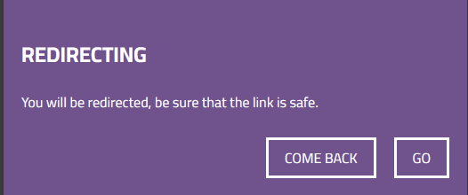
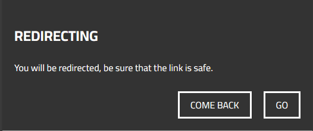

# DEV 

  

## Anim

---

- [Installation](#Installation)
  - [Download](#Download)
  - [NPM-Installation](#NPM-Installation)
- [Docs](#Docs)

---

### Installation

#### Download

- First of all, you are going to include the js file `anim.min.js`, or rather `anim.js` for developers.
  Then, you are going to add the `anim.min.css`, or rather `anim.css` for developers which is the style file.

- Also, there are various versions of styles you can use them, you can find them in the `css/themes/` folder. You can try them.
  See them below:

- You just need to put the theme file after the `anim.css` or `anim.min.css` file.

---

#### NPM-Installation

- Run `npm i dev-animate`.

- Then include the animate script ``.

- Then include the animate style `<link type="stylesheet" href="./node_modules/dev-animate/css/anim.min.css" />`.

- Also you can include any theme you want from the `./node_modules/dev-animate/css/themes/` folder

---

### Docs

There are various built-in functions in this library.

> ##### An important tip
>
> You can use `animate.js` file only, if you just need the animations,
> but if you need to use the `alerters` and the `pop-ups`. Please consider the `anim.min.js` file.

1 - `pop_up_choice(subject (optional), text (optional), btn1_context (optional), btn2_context (optional), callback())`. this function is made to make a pop up window
and you can add callback function, which will be called when the second action `confirm` is made like in

> You cannot pass any data through the `pop_up_choice()`. And It will appear with the default text.

2 - `alerter(massage)`. Which is an enhanced alerter instead of the `window.alert(massage)`, because `window.alert(massage)`
is a sync process.

3- `pop_up(subject (optional), text (optional), btn1_context (optional))`. It is like `pop_up_choice()`, but with no return,
with only one choice. Actually, you can say that it is a toggle alerter.
